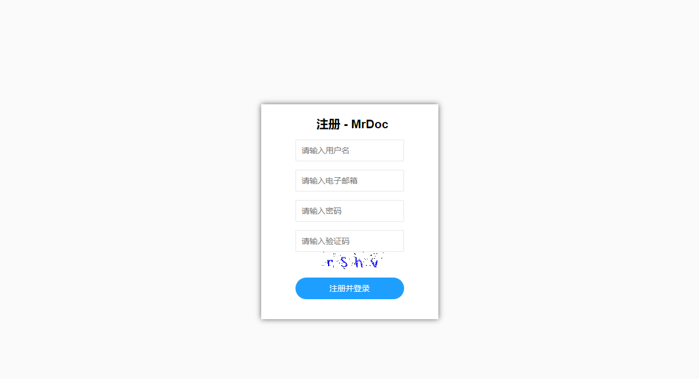
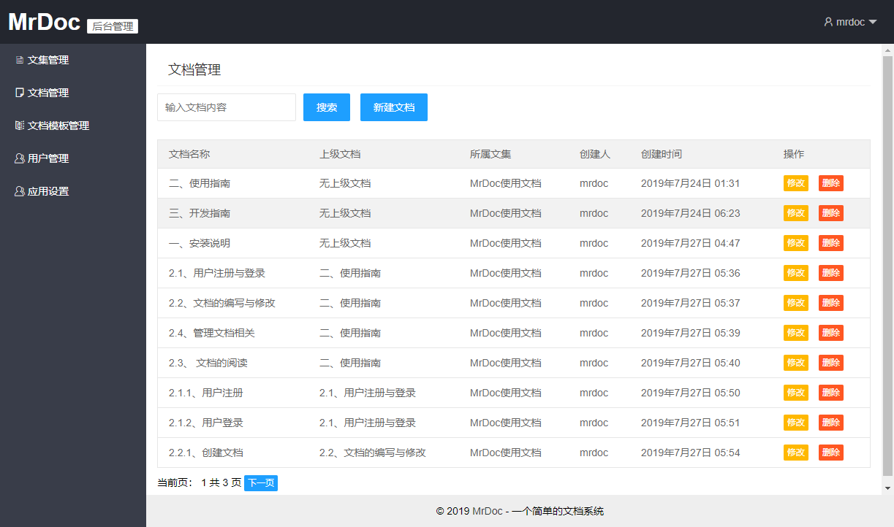
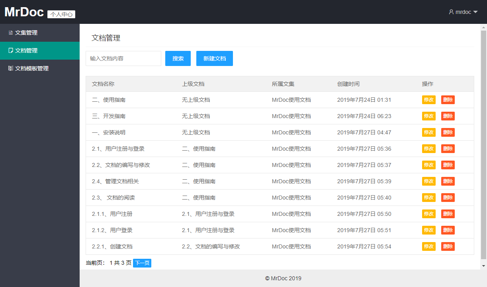

# MrDoc - 一个简单的文档写作应用


## 介绍
一个简单的MarkDown文档写作系统。

MrDoc拥有以下特点：

- 基于Django自带的用户模型，实现简单高效的用户管理，支持用户注册、用户登录、管理员等控制等功能；
- 基于Editormd的Markdown编辑器，支持Markdown语法的文档写作，支持图片粘贴上传；
- 提供文档模板功能，支持文档模板的创建、修改；
- 仿GitBook文档阅读页面，支持文档阅读页面的字体缩放，字体类型修改；
- 支持三级目录层级显示；
- 使用方便、二次开发修改也方便；


在开发过程中，参考和借鉴了GitBook、ShowDoc、Wordbook等应用的功能和样式。

## 软件架构

后端基于Python Web框架Django

编程语言：Python 3

后端框架：Django 2.1

前端UI库：LayUI 2.5.4

MarkDown编辑器：Editormd

页面社交分享：Share.js

Markdown科学公式：Katex.js

## 安装教程

### 1、安装依赖库
```
pip install -r requirements.txt
```

### 2、配置数据库信息
默认情况下，MrDoc使用Django的SQLite数据库，如果你使用的是MrDoc源码附带的Sqlite数据库，则无需另外配置数据库。
如果有配置其他数据库的需求，请在/MrDoc/MrDoc目录下打开settings.py文件，在约80行的位置，将如下代码：
```
DATABASES = {
 'default': {
 'ENGINE': 'django.db.backends.sqlite3',
 'NAME': os.path.join(BASE_DIR, 'db.sqlite3'),
 }
}
```
按照自己数据库的信息，将其修改如下格式，下面以MySQL为例：
```
DATABASES = {
 'default': {
 'ENGINE': 'django.db.backends.mysql', # 使用的数据库后端
 'NAME': 'mrdoc', # 数据库名
 'USER':'root', # 数据库用户
 'PASSWORD':'123456789', # 数据库用户密码
 'HOST':'', # 数据库主机地址
 'PORT':'3306', # 数据库端口
 }
}
```
### 3、初始化数据库
在安装完所需的第三方库并配置好数据库信息之后，我们需要对数据库进行初始化。

在项目路径下打开命令行界面，运行如下命令生成数据库迁移：
```
python manage.py makemigrations
```
接着，运行如下命令执行数据库迁移：
```
python manage.py migrate
```
执行完毕之后，数据库就初始化完成了。

### 4、创建管理员账户
在初始化完数据库之后，需要创建一个管理员账户来管理整个MrDoc，在项目路径下打开命令行终端，运行如下命令：
```
python manage.py createsuperuser
```
按照提示输入用户名、电子邮箱地址和密码即可。
### 5、测试运行
在完成上述步骤之后，即可运行使用MrDoc。

在测试环境中，可以使用Django自带的服务器运行MrDoc，其命令为：
```
python manage.py runserver
```


## 版本更新日志

版本更新日志详见：[CHANGES.md](./CHANGES.md)

## 更多截图

### 文档界面


### 登录界面


### 注册界面


### 文档写作界面


### 文档模板界面


### 管理员后台界面


### 普通用户后台界面
